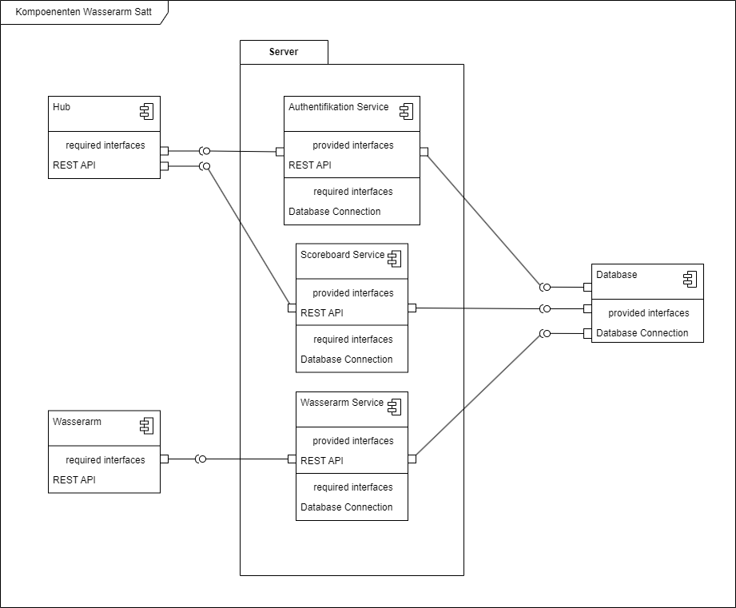

# Wasserarm Satt – Technisches Designdokument

## 1. Überlegungen

#### 1.1 Annahmen

#### 1.2 Einschränkungen

#### 1.3 Systemumgebung

## 2. Architektur

#### 2.1 Übersicht

#### 2.2 Komponentendiagramme

#### 2.3 Klassendiagramme

#### 2.4 Sequenzdiagramme

#### 2.5 Deploymentdiagramme

#### 2.6 Ablaufdiagramme

#### 2.7 Zustandsdiagramme

## 3 Benutzeroberflächendesign

## 4 Anhänge und Referenzen

#### 4.1 Definitionen und Abkürzungen

#### 4.2 Referenzen
